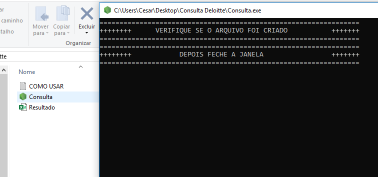

# Query in Two Tables and Export CSV File

Aplicação que se conecta a um banco de dados, junta duas tabelas e entrega um arquivo CSV, tudo empacotado com PKG.

### How to.

- Install dependencies, see pakage.json
- Config database conections (inside "consultar.js)
- Customize query
- Packaging aplication.  Command: pkg .

### Documentation

#### How to connect using Node + SQL

[W3SCHOOLS NODE+SQL](https://www.w3schools.com/nodejs/nodejs_mysql_select.asp)

#### Video, How to use "PKG"

[DEVPLENO Channel](https://www.youtube.com/watch?v=pZNeUcCPwEs&t=218s)

#### Convert object to .CSV

[NPM Obj_to_CSV](https://www.npmjs.com/package/objects-to-csv)

[By César J. Fois](https://cesarfois.github.io/)

